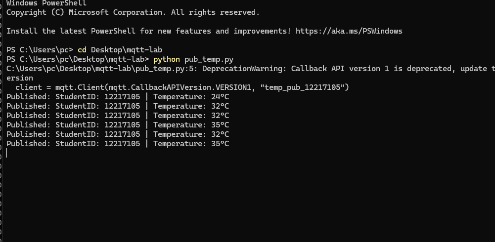
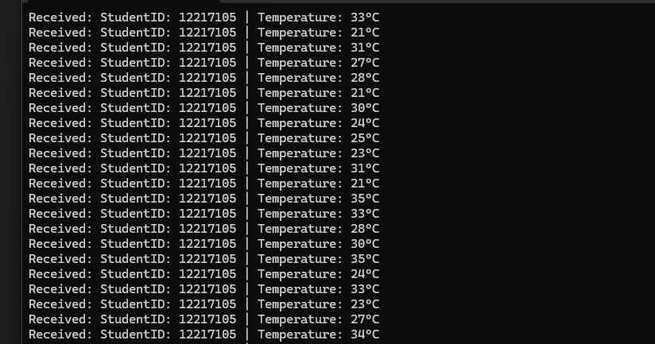
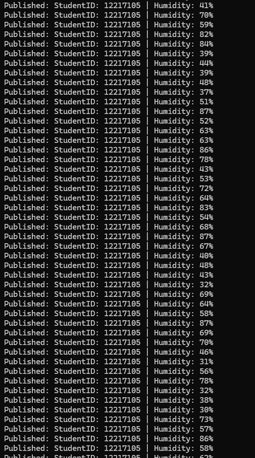
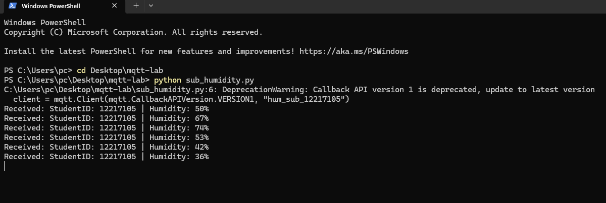
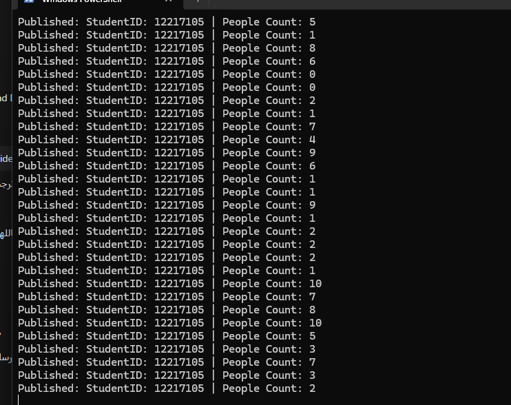
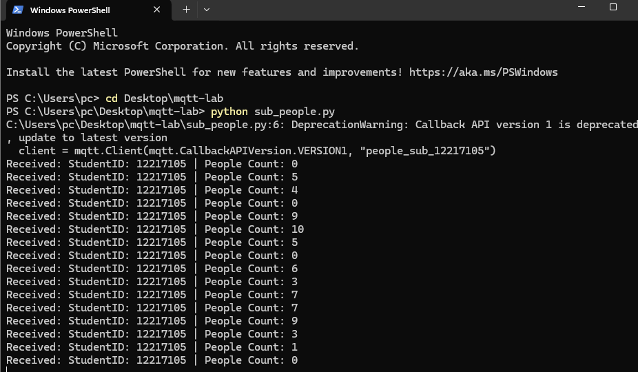

# MQTT Lab – Mosquitto + Paho (Temperature, Humidity, People Counter)
**Student Name:** Salah Nofal  
**Student ID:** 12217105  
**Course Lab:** MQTT – IoT Messaging Using Mosquitto Broker & Paho Client  

---

## Overview  
This lab demonstrates an MQTT setup using **Mosquitto Server** as the broker and **Paho Python Client** as publishers and subscribers.

Three data streams were implemented:
-  **Temperature Publisher + Subscriber**  
-  **Humidity Publisher + Subscriber**  
-  **People Counter Publisher + Subscriber**  

Each message sent contains my **Student ID (12217105)** as required.

---

##  Installation  
### 1️Install Mosquitto Broker  
Installed Mosquitto (mosquitto + mosquitto_pub + mosquitto_sub).

### 2️ Install Paho MQTT for Python  
pip install paho-mqtt

---

---

##  Results  

###  Temperature  
#### Publisher:  

#### Subscriber:  

---

###  Humidity  
#### Publisher:  

#### Subscriber:  

---

###  People Counter  
#### Publisher:  

#### Subscriber:  

---

##  Conclusion  
The MQTT Lab successfully demonstrates:
- Running Mosquitto broker  
- Using multiple publishers & subscribers  
- Using topics for temperature, humidity & people count  
- Sending student ID inside every message  
- Displaying full logs on both ends  
- Uploading complete lab to GitHub exactly as required  

---

## GitHub Repository  
 **Repository:** https://github.com/SalahNofal1/mqtt-lab-12217105
